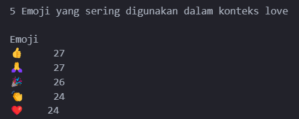

# Emoji Analysis

## Data
Data didapatkan dari Kaggel pada link : https://www.kaggle.com/datasets/waqi786/emoji-trends-dataset

Dataset terdiri dari 5 kolom dan 5000 entries

## Deskripsi
Analisi penggunaan emoji bertujuan untuk menganalisis penggunaan emoji untuk konteks tertentu. Analisis yang dilakukan adalah:
1. Bagaimana penggunaan emoji berdasarkan context yang ada?
2. Apa emoji yang sering digunakan berdasarkan gender pengguna?
3. Emoji apa yang digunakan pengguna laki-laki dan perempuan untuk setiap context 'angry' dan 'love'?
4. Apakah penggunaan emoji dengan context 'angry' tetapi dengan platform yang berbeda menggunakan emoji yang sama?

## Analisis
Analisis yang dilakukan adalah dengan mengecek dataset apakah ada yang memiliki nilai kosong, nilai yang duplikat, dan nilai yang memiliki kesalahan format. Selanjutnya, eksplorasi data dilakukan dengan melakukan visualisasi data untuk mengidentifikasi pola yang menarik dan mendapatkan informasi baru.

## Hasil
1. Penggunaan emoji berdasarkan konteks :
**context love**

emoji yang digunakan dalam context love adalah :

Lima emoji yang paling sering digunakan dalam context love

**context confusion**

emoji yang digunakan dalam context confusion adalah :

Lima emoji yang paling sering digunakan dalam context confusion

**context love**

emoji yang digunakan dalam context cool adalah :

Lima emoji yang paling sering digunakan dalam context cool

