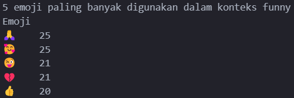
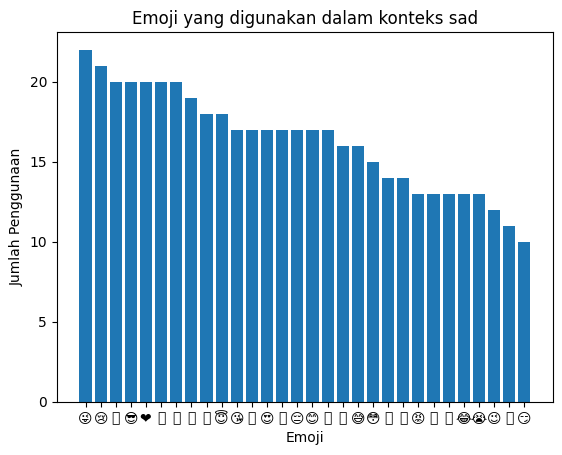
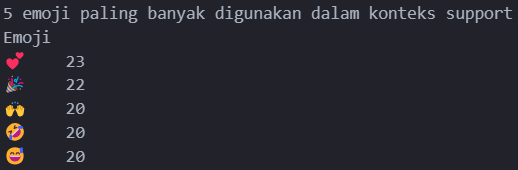

# Emoji Analysis

## Data
Data didapatkan dari Kaggel pada link : https://www.kaggle.com/datasets/waqi786/emoji-trends-dataset

Dataset terdiri dari 5 kolom dan 5000 entries

## Deskripsi
Analisi penggunaan emoji bertujuan untuk menganalisis penggunaan emoji untuk konteks tertentu. Analisis yang dilakukan adalah:
1. Bagaimana penggunaan emoji berdasarkan context yang ada?
2. Apa emoji yang sering digunakan berdasarkan gender pengguna?
3. Emoji apa yang digunakan pengguna laki-laki dan perempuan untuk setiap context 'angry' dan 'love'?
4. Apakah penggunaan emoji dengan context 'angry' tetapi dengan platform yang berbeda menggunakan emoji yang sama?

## Analisis
Analisis yang dilakukan adalah dengan mengecek dataset apakah ada yang memiliki nilai kosong, nilai yang duplikat, dan nilai yang memiliki kesalahan format. Selanjutnya, eksplorasi data dilakukan dengan melakukan visualisasi data untuk mengidentifikasi pola yang menarik dan mendapatkan informasi baru.

## Hasil
### Penggunaan emoji berdasarkan konteks :
**context love**

emoji yang digunakan dalam context love adalah :

Lima emoji yang paling sering digunakan dalam context love

**context confusion**

emoji yang digunakan dalam context confusion adalah :

Lima emoji yang paling sering digunakan dalam context confusion

**context cool**

emoji yang digunakan dalam context cool adalah :

Lima emoji yang paling sering digunakan dalam context cool

**context celebration**

emoji yang digunakan dalam context celebration adalah :

Lima emoji yang paling sering digunakan dalam context celebration

**context funny**

emoji yang digunakan dalam context funny adalah :

Lima emoji yang paling sering digunakan dalam context funny

**context angry**

emoji yang digunakan dalam context angry adalah :

Lima emoji yang paling sering digunakan dalam context angry

**context sad**

emoji yang digunakan dalam context sad adalah :

Lima emoji yang paling sering digunakan dalam context sad

**context support**

emoji yang digunakan dalam context support adalah :

Lima emoji yang paling sering digunakan dalam context support

**context surprise**

emoji yang digunakan dalam context surprise adalah :

Lima emoji yang paling sering digunakan dalam context surprise

**context happy**

emoji yang digunakan dalam context happy adalah :

Lima emoji yang paling sering digunakan dalam context happy

### Emoji yang digunakan berdasarkan gender pengguna
berdasarkan hasil analisis, penggunaan emoji berdasarkan gender adalah:

- Emoji yang paling banyak digunakan dalam Perempuan adalah '🎉' dengan 96 kemunculan.

- Emoji yang paling banyak digunakan dalam laki-laki adalah '🤣' dengan 99 kemunculan.

### Emoji yang digunakan laki-laki dan perempuan saat berada di context angry dan love

**penggunaan Angry pada laki-laki**

**penggunaan Angry pada perempuan**

**penggunaan Love pada laki-laki**

**penggunaan love pada perempuan**

### Penggunaan emoji dengan context angry diberbagai platform

